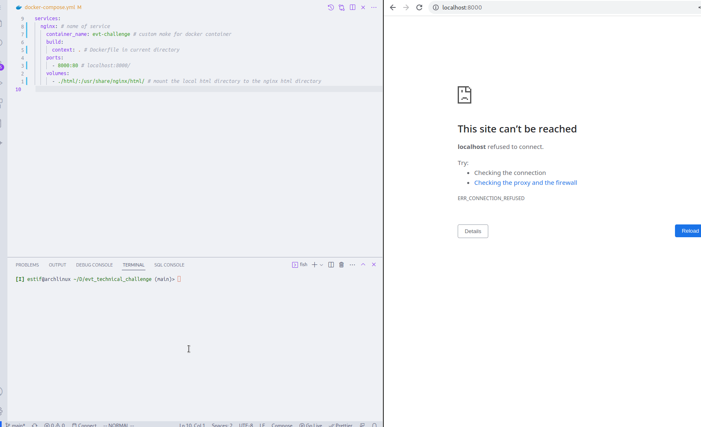

# EVT Technical Challenge 2021

## How to run?

- `docker-compose up -d`: create and start container in daemon mode
- `docker-compose down`: stop container

## Completion

- [x] Single entry point to start automation process
- [x] All supporting code to automate process
- [x] Documentation of how the solution works and why you chose the specific tools in use
- [x] A viewable webpage provided above on a secure port (self-signed certificate OK)

## Stack used

- [docker](#docker)
- [nginx](#nginx)

## Docker

Docker is a popular platform dedicated to the development, shipment and running of applications in Docker containers.

A Docker Container is a lightweight, stand-alone, platform-independent executable package. It has all the dependencies required to run an application.

A Docker image is a template of instructions user to create container(s).

Docker compose is a tool that assists in defining and sharing multi-container applications. By using docker-compose, we can define the services in a YAML file, as well as spin them up and tear them down with one single command.

### Why Docker?

- rapid development: designed for portability and efficiency
- scale up quickly because of how easy it is to configure
- virtual machine:

  - higher memory usage
  - less portable: software might not work on different machines
  - slower boot-up time

## nginx

- Nginx is a web and reverse proxy server.It can be used to serve static content, such as HTML files, CSS files, and images, as well as dynamic content, such as PHP scripts and database queries.

- The default folder that nginx uses to serve static content is `/usr/share/nginx/html`

### Why nginx?

- it is stable, scalable, and can handle concurrency better than apache.
