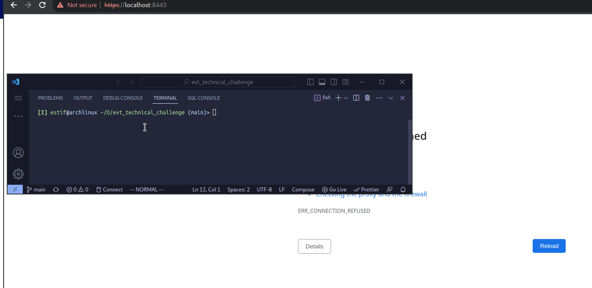

# EVT Technical Challenge 2021

## Task Description

Create an environment to display a single webpage. The completion of the goal will consist of a single command or script that will instantiate the automation of building a secure webserver that will display a single webpage. [more info](./challenge.md)

## How to run?

1. `git clone https://github.com/justEstif/evt_technical_challenge.git && cd evt_technical_challenge`
2. `docker-compose up -d`: create and start container in daemon mode
3. `docker-compose down`: stop container

## Completion

- [x] Single entry point to start automation process
- [x] All supporting code to automate process
- [x] Documentation of how the solution works and why you chose the specific tools in use
- [x] A viewable webpage provided above on a secure port (self-signed certificate OK)

## Stack used

- [docker with alpine](#docker)
- [nginx](#nginx)

## Docker

Docker is a popular platform dedicated to the development, shipment and running of applications in Docker containers.

A Docker Container is a lightweight, stand-alone, platform-independent executable package. It has all the dependencies required to run an application.

A Docker image is a template of instructions user to create container(s).

Docker compose is a tool that assists in defining and sharing multi-container applications. By using docker-compose, we can define the services in a YAML file, as well as spin them up and tear them down with one single command.

### Why Docker?

- rapid development: designed for portability and efficiency
- scale up quickly because of how easy it is to configure
- virtual machine:

  - higher memory usage
  - less portable: software might not work on different machines
  - slower boot-up time

- The main caveat of using Docker containers over a VM is that they are less secure. Docker container share the same kernel as the host hence, a kernel bug inside a container could exploit the host OS.

## nginx

- Nginx is a web and reverse proxy serve that that can also be used as a load balancer and to serve static content, such as HTML files, CSS files, and images.

  - A load balancer distributes traffic across multiple servers and improves performance.

- The default folder that nginx uses to serve static content is `/usr/share/nginx/html`

### Why nginx?

- it is stable, scalable, more performant and uses less memory that apache.
- extremely fast: designed to cater for thousands of requests per seconds
- lightweight and efficient: ideal for high-traffic web applications
- optimized to serve static files
- simple configuration: nginx.conf

### Why nginx:alpine?

- Alpine linux and much smaller than most distrubuition base images and thus leads to much slimmer images in general. It is also know for being secure.
- The main caveat to note is that it does use musl libc instead of glibc and friends, so software will often run into issues depending on the depth of their libc requirements/assumptions.
